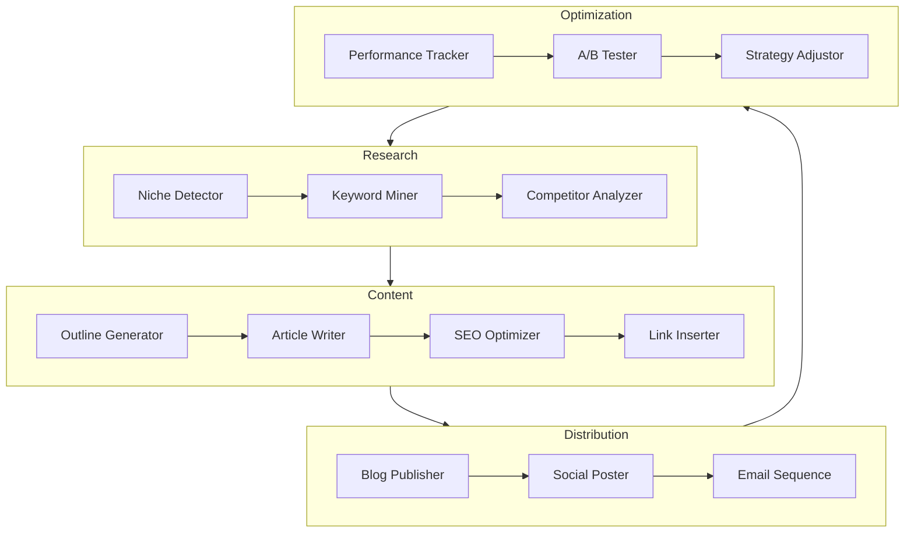
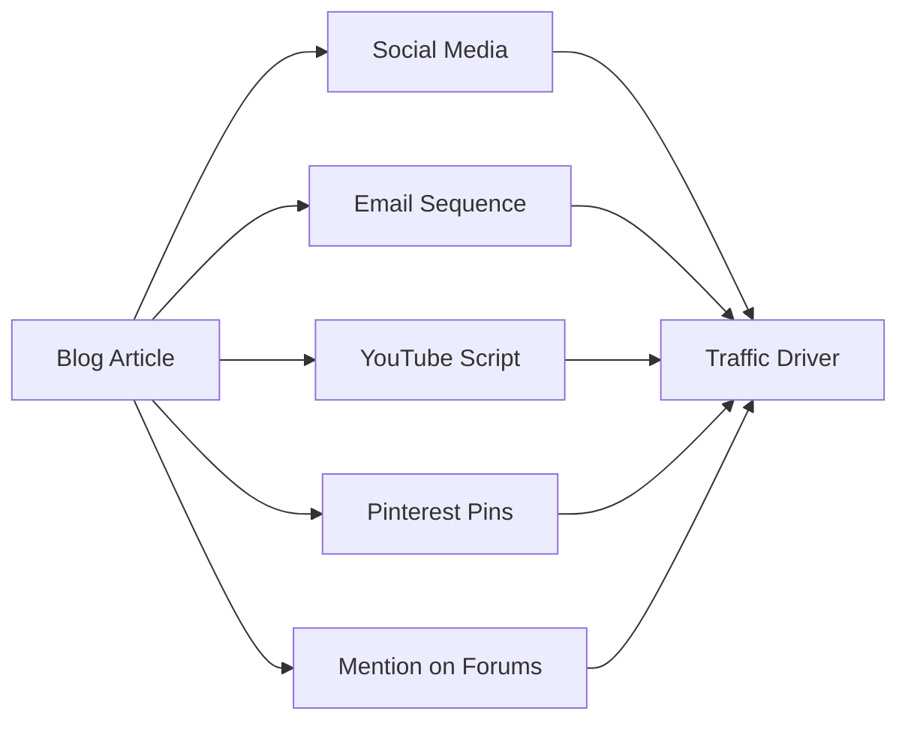

# Affiliate Marketing Automation with AI Agents: Complete 2024 Guide

**Automated affiliate marketing** has transformed from a pipe dream into a profitable reality for thousands of entrepreneurs. By leveraging **Hermes AI agent** technology, you can build affiliate marketing systems that generate passive income while you sleep.

This comprehensive guide covers everything from setup to scaling—showing you how to use **AI affiliate automation** to create sustainable revenue streams.

## The Evolution of Affiliate Marketing

### Traditional Approach

- Manual keyword research (hours per day)
- Writing content one article at a time
- Manual link placement and tracking
- Sporadic social media posting
- Reactive strategy adjustments

**Result**: Most affiliates burn out before seeing meaningful income

### The AI-Powered Approach

- Automated keyword discovery
- Batch content generation at scale
- Intelligent link optimization
- Multi-channel automated distribution
- Predictive performance analytics

**Result**: Sustainable systems generating $10K+ monthly

## How Hermes AI Agents Automate Affiliate Marketing

### The Multi-Agent Workflow



### Agent Capabilities Breakdown

**Research Agent**:
```python
class AffiliateResearchAgent:
    """Discovers profitable affiliate opportunities"""
    
    async def analyze_niche(self, niche: str):
        # Find affiliate programs
        programs = await self.find_programs(niche)
        
        # Analyze commission structures
        opportunities = []
        for program in programs:
            metrics = {
                "commission_rate": program.commission,
                "cookie_duration": program.cookie_days,
                "epc": program.earnings_per_click,
                "gravity": program.popularity_score
            }
            opportunities.append(metrics)
        
        return self.rank_opportunities(opportunities)
```

**Content Agent**:
- Generates comparison articles
- Creates product review content
- Writes buying guides
- Produces "best of" listicles
- Develops email sequences

## Building Your Automated Affiliate System

### Phase 1: Niche Selection & Validation

**AI-Powered Niche Analysis**:

```python
async def validate_niche(niche_idea: str):
    # Check search volume trends
    trends = await get_trend_data(niche_idea)
    
    # Analyze competition level
    competition = await analyze_serp_competition(niche_idea)
    
    # Find affiliate programs
    programs = await find_affiliate_programs(niche_idea)
    
    # Calculate earning potential
    opportunity_score = calculate_opportunity(
        trends.volume,
        competition.difficulty,
        programs.avg_commission
    )
    
    return {
        "niche": niche_idea,
        "score": opportunity_score,
        "monthly_potential": estimate_revenue(programs, trends),
        "recommended_programs": programs[:5]
    }
```

### Phase 2: Content Pipeline Setup

**Automated Content Calendar**:

| Content Type | Frequency | Production Time | AI Agent |
|-------------|-----------|-----------------|----------|
| Product Reviews | Daily | 30 min | ReviewAgent |
| Comparison Posts | 3x/week | 45 min | CompareAgent |
| Best-of Lists | Weekly | 1 hour | ListicleAgent |
| Email Campaigns | 2x/week | 20 min | EmailAgent |

**Content Generation Example**:

```python
class ReviewContentAgent:
    async def create_review(self, product: Product):
        research = await self.research_product(product)
        
        structure = {
            "intro": self.write_intro(product, research),
            "features": self.analyze_features(product),
            "pros_cons": self.compare_benefits(product),
            "pricing": self.explain_commission_structure(product),
            "alternatives": self.suggest_competitors(product),
            "conclusion": self.write_cta(product)
        }
        
        optimized = await self.seo_optimize(structure)
        return await self.insert_affiliate_links(optimized)
```

### Phase 3: Link Optimization

**Intelligent Affiliate Link Management**:

```python
class AffiliateLinkOptimizer:
    def __init__(self):
        self.link_database = {}
        self.performance_data = {}
    
    def insert_links(self, content: str, product: Product):
        # Identify optimal link placement
        opportunities = self.find_link_opportunities(content)
        
        # Select best-performing links
        for opp in opportunities:
            best_link = self.select_optimal_link(
                product, 
                opp.context
            )
            content = self.insert_link(content, opp, best_link)
        
        return content
    
    async def optimize_by_performance(self):
        # A/B test different link placements
        # Replace underperforming links
        # Update to highest-converting offers
```

## Advanced Automation Strategies

### Multi-Channel Content Distribution

**The Content Amplification Hub**:



**Agent Responsibilities**:

| Channel | Primary Agent | Task Frequency |
|---------|--------------|----------------|
| Blog | ContentAgent | Daily |
| Twitter/X | SocialAgent | 5x/day |
| LinkedIn | SocialAgent | 2x/day |
| Email | EmailAgent | 2x/week |
| Pinterest | VisualAgent | 10 pins/day |
| Forums | CommunityAgent | Auto-respond |

### Dynamic Content Optimization

**Real-Time Performance-Based Updates**:

```python
async def optimize_content_performance():
    # Analyze click-through rates
    low_ctr_articles = await find_underperforming_content(
        threshold=0.02
    )
    
    for article in low_ctr_articles:
        # Test new headlines
        new_title = await generate_headline_variants(article)
        
        # Optimize internal linking
        new_links = await suggest_related_articles(article)
        
        # Update call-to-action
        new_cta = await generate_new_cta(article)
        
        # Deploy improvements
        await update_article(
            article.id,
            title=new_title[0],
            internal_links=new_links,
            cta=new_cta
        )
```

### Predictive Affiliate Strategy

**AI Forecasting for Trending Products**:

```python
class TrendPredictionAgent:
    async def forecast_trends(self, category: str):
        # Analyze multiple data sources
        sources = [
            self.search_trends(category),
            self.sales_data(category),
            self.social_mentions(category),
            self.news_sentiment(category)
        ]
        
        predictions = await asyncio.gather(*sources)
        
        return {
            "emerging_products": self.identify_upcomers(predictions),
            "best_timing": self.calculate_optimal_timing(predictions),
            "content_strategy": self.plan_content_calendar(predictions)
        }
```

## Revenue Optimization Techniques

### Commission Structure Analysis

```python
async def optimize_commission_strategy():
    programs = await get_enrolled_programs()
    
    for program in programs:
        metrics = {
            "conversion_rate": program.conversions / program.clicks,
            "average_order": program.revenue / program.sales,
            "epc": program.earnings / program.clicks,
            "trend": program.trend_90d
        }
        
        if metrics["epc"] < THRESHOLD:
            # Find alternative programs
            alternatives = await find_better_programs(
                program.category
            )
            await recommend_program_switch(
                current=program,
                alternative=alternatives[0]
            )
```

### Funnel Optimization

**Automated Funnel Analysis**:

```
┌─────────────────────────────────────────┐
│           Traffic Sources               │
│     SEO | Social | Email | Paid        │
└─────────────────┬───────────────────────┘
                  │
                  ▼
┌─────────────────────────────────────────┐
│         Content Consumption             │
│    Blog > Video > Comparison Table     │
└─────────────────┬───────────────────────┘
                  │
                  ▼
┌─────────────────────────────────────────┐
│         Conversion Points               │
│    Review > CTA > Affiliate Link       │
└─────────────────┬───────────────────────┘
                  │
                  ▼
            [COMMISSION]
```

**Optimization Tactics**:
- A/B test content formats
- Optimize call-to-action placement
- Reduce friction in buyer journey
- Personalize recommendations

## Success Metrics & Tracking

### Key Performance Indicators

| Metric | Healthy Range | Tracking Agent |
|--------|---------------|----------------|
| **CTR** | 2-5% | AnalyticsAgent |
| **Conversion Rate** | 1-3% | ConversionAgent |
| **EPC** | $0.50-$5.00 | RevenueAgent |
| **Content ROI** | 300%+ | ProfitAgent |
| **Organic Growth** | +20%/month | SEOAgent |

### Automated Reporting Dashboard

**Weekly Insights**:
- Top-performing content pieces
- Highest-converting affiliate links
- Emerging opportunity niches
- Content gap analysis

**Monthly Review**:
- Revenue by traffic source
- Commission optimization recommendations
- Content strategy adjustments
- Competitive positioning analysis

## Case Studies: Real Results

### Case Study 1: The Tech Review Site

**Background**: Solo founder, technology niche
**Challenge**: Could only publish 2 articles/week manually
**Solution**: **Hermes AI agent** content system

**Results (12 Months)**:
- Content output: 2/day (from 2/week)
- Organic traffic: +450%
- Affiliate income: $8,200/month (from $800)
- Time invested: 10 hours/week (from 40+)

### Case Study 2: The Lifestyle Blogger

**Background**: Part-time blogger, home goods niche
**Challenge**: Inconsistent posting, poor SEO
**Solution**: Multi-agent automation suite

**Results (6 Months)**:
- Pinterest traffic: +900%
- Email list growth: +15,000 subscribers
- Passive income: $4,500/month
- Automation level: 85%

### Case Study 3: The Comparison Site

**Background**: Price comparison platform
**Challenge**: Maintaining fresh comparison data
**Solution**: Automated data aggregation + content

**Results (9 Months)**:
- Product comparisons: 500+ (from manual 20)
- Top 3 rankings: 180 keywords
- Monthly revenue: $22,000
- Team size: 1 person (handling what took 5+)

## Getting Started: Your 90-Day Action Plan

### Week 1-2: Foundation

- [ ] Select validated niche with Hermes NicheFinder
- [ ] Join 3-5 affiliate programs
- [ ] Set up content management system
- [ ] Connect analytics and tracking

### Week 3-4: Content Pipeline

- [ ] Generate 30 foundation articles
- [ ] Set up auto-publishing workflow
- [ ] Configure social distribution
- [ ] Launch email capture sequences

### Week 5-8: Optimization

- [ ] Implement A/B testing
- [ ] Optimize top 20% of content
- [ ] Scale winning formats
- [ ] Add new traffic channels

### Week 9-12: Scaling

- [ ] Launch second niche site
- [ ] Develop authority content
- [ ] Build email automation
- [ ] Plan product creation

## Common Pitfalls to Avoid

### ❌ Spammy Content Generation

**Mistake**: Mass-producing low-quality content
**Solution**: Hermes agents create value-first content with natural link integration

### ❌ Over-Optimization

**Mistake**: Too many affiliate links, poor user experience
**Solution**: AI balances monetization with readability (optimal 1-2 links/300 words)

### ❌ Set It and Forget It

**Mistake**: Launching automation, never reviewing
**Solution**: Weekly dashboard review, monthly strategy sessions

### ❌ Ignoring Compliance

**Mistake**: Missing FTC disclosures
**Solution**: Automated compliance checking on all content

## Advanced Techniques

### Email Automation Integration

```python
class AffiliateEmailAgent:
    async def build_sequence(self, segment: str):
        sequence = [
            {
                "day": 1,
                "type": "welcome",
                "content": await self.write_welcome_email(segment)
            },
            {
                "day": 3,
                "type": "value",
                "content": await self.write_tutorial_email(segment)
            },
            {
                "day": 7,
                "type": "promotion",
                "content": await self.write_recommendation_email(segment)
            }
        ]
        return await self.deploy_sequence(sequence)
```

### Cross-Niche Expansion

**AI-Identified Opportunity Mapping**:
1. Analyze current niche performance
2. Find adjacent profitable niches
3. Repurpose existing content strategies
4. Launch satellite sites automatically

### Partnership Automation

**Outreach Agent**:
- Identifies potential partners
- Drafts personalized outreach
- Follows up automatically
- Tracks response rates

## The Future of Affiliate Automation

### Emerging Capabilities

1. **Voice Search Optimization**: AI creates conversational content
2. **Video Automation**: Auto-generate review videos
3. **Predictive Pricing**: AI recommends best-priced products
4. **Multi-Language Scaling**: Auto-translate for global markets

### Hermes Roadmap

- **Q1 2025**: Video content automation
- **Q2 2025**: Podcast integration
- **Q3 2025**: Advanced personalization engine
- **Q4 2025**: Full-funnel attribution

## Conclusion

**Automated affiliate marketing** through **Hermes AI agents** represents the future of passive income generation. By automating research, content creation, distribution, and optimization, you build systems that scale without proportional time investment.

The key is starting with a solid foundation—a validated niche, quality programs, and intelligent automation—then letting the AI agents handle the heavy lifting while you focus on strategy and growth.

**Ready to build your automated affiliate empire?**

1. [Start Free Trial](/signup) - 14 days full access
2. [Book Strategy Session](/consultation) - Personalized plan
3. [View Pricing](/pricing) - Plans for every level

---

*Transform affiliate marketing from a time sink into a revenue machine with Hermes Mission Freedom.*