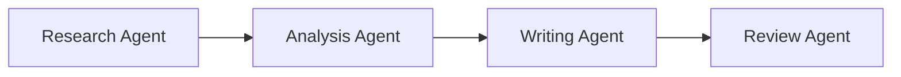
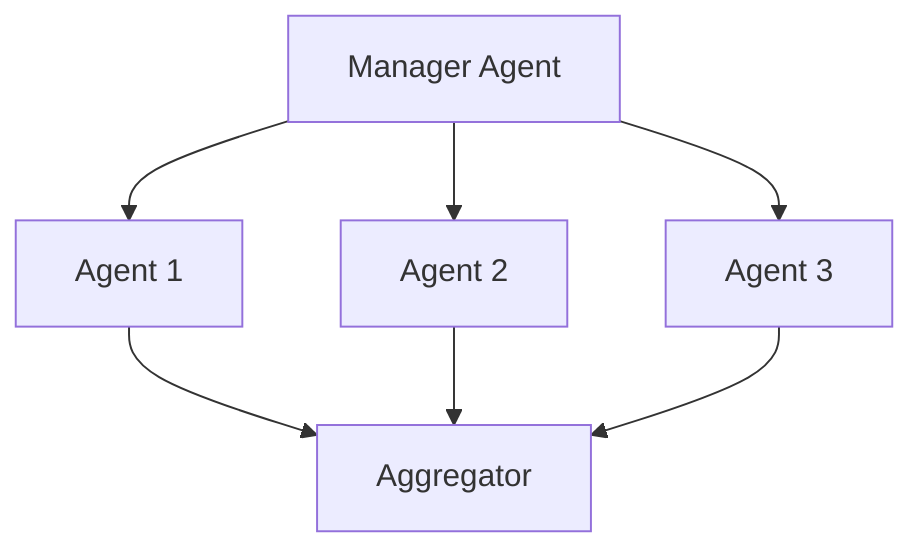

# Building Powerful AI Agent Skills: The Complete Guide for 2024

Artificial intelligence agents are revolutionizing how businesses automate tasks, interact with customers, and scale operations. Whether you're working with **Hermes AI agent** technology or building custom solutions, understanding how to develop effective **AI skills** is crucial for success.

## What Are AI Agent Skills?

**Agent skills** are modular, reusable capabilities that give AI agents specific abilities to perform tasks. Think of them as specialized tools in an agent's toolkit—each skill enables the agent to handle particular domains of work, from web scraping to content creation.

### Key Characteristics of Effective AI Skills:

- **Modularity**: Skills can be mixed, matched, and reused across different agents
- **Composability**: Multiple skills can work together for complex workflows
- **Scalability**: Add new capabilities without rebuilding the entire system
- **Maintainability**: Update individual skills without affecting other functionality

## Building Your First Hermes AI Agent Skill

With **Hermes agent** technology, creating skills follows a structured approach:

### Step 1: Define the Skill's Purpose

```python
# Example skill structure for Hermes AI agent
class ResearchSkill:
    """A skill that enables web research and data gathering"""
    
    def __init__(self):
        self.name = "web_research"
        self.description = "Search and analyze web content"
        self.capabilities = ["search", "summarize", "extract"]
    
    async def execute(self, query: str, context: dict = None):
        # Skill implementation
        pass
```

### Step 2: Implement Core Functionality

Focus on:
- Input validation and sanitization
- Error handling and recovery
- Async/await patterns for efficiency
- Clear output formatting

### Step 3: Add Context Awareness

The best **AI skills** understand their environment:
- Access to conversation history
- Knowledge of previous actions
- State management across sessions

## Multi-Agent Orchestration Patterns

When building sophisticated systems, **multi-agent orchestration** becomes essential. Here's how to structure agent teams effectively:

### 1. Sequential Processing Pattern



**Best for**: Linear workflows like content creation pipelines

### 2. Parallel Processing Pattern



**Best for**: Independent tasks that can run simultaneously

### 3. Router Pattern

A specialized agent analyzes requests and routes them to the appropriate specialist agent based on content type or complexity.

### 4. Group Chat Pattern

Multiple agents collaborate on a problem, discussing and refining solutions together—similar to how humans brainstorm.

## Best Practices for AI Skill Development

### 1. Start with Clear Documentation

Every skill should include:
- **Purpose statement**: What the skill does
- **Input/output specifications**: Expected data formats
- **Error handling**: How failures are managed
- **Examples**: Sample inputs and expected outputs

### 2. Implement Version Control

Track skill versions to ensure:
- Backward compatibility
- Rollback capabilities
- Change history

### 3. Design for Testing

Create unit tests for each skill:
```python
def test_research_skill():
    skill = ResearchSkill()
    result = skill.execute("AI automation trends 2024")
    assert result.status == "success"
    assert len(result.data) > 0
```

### 4. Monitor Performance

Track key metrics:
- Execution time
- Success rate
- Resource usage
- Error frequency

## Advanced Skill Patterns

### Skill Chaining

Connect multiple skills in sequence where output from one becomes input for another:

```python
workflow = [
    ResearchSkill(),
    AnalysisSkill(),
    ContentGenerationSkill(),
    QualityCheckSkill()
]
```

### Skill Composition

Combine multiple skills to create new capabilities:

```python
class EnhancedResearchSkill:
    def __init__(self):
        self.researcher = ResearchSkill()
        self.summarizer = SummarizationSkill()
        self.validator = FactCheckingSkill()
    
    async def execute(self, query):
        raw_data = await self.researcher.execute(query)
        summary = await self.summarizer.execute(raw_data)
        validated = await self.validator.execute(summary)
        return validated
```

### Dynamic Skill Loading

Load skills on-demand based on task requirements:

```python
async def load_skill(skill_name: str):
    skill_registry = {
        "web_research": ResearchSkill,
        "content_writer": ContentSkill,
        "data_analyzer": AnalysisSkill
    }
    return skill_registry[skill_name]()
```

## Real-World Applications

### E-commerce Automation

**AI skills** for e-commerce might include:
- **Product Research**: Find trending items and analyze competition
- **Description Writing**: Generate SEO-optimized product descriptions
- **Price Monitoring**: Track competitor pricing
- **Customer Support**: Handle common inquiries

### Content Marketing

**Hermes AI agent** skills for content marketing:
- **Keyword Research**: Discover high-value search terms
- **Outline Generation**: Create article structures
- **Content Writing**: Produce draft content
- **SEO Optimization**: Refine content for search engines

### Data Processing

Skills for handling data workflows:
- **Data Collection**: Gather from multiple sources
- **Transformation**: Clean and format data
- **Analysis**: Generate insights and reports
- **Visualization**: Create charts and dashboards

## Performance Optimization

### Caching Strategies

```python
@lru_cache(maxsize=1000)
def skill_result_cache(key: str):
    # Cache frequent skill outputs
    pass
```

### Parallel Execution

```python
async def execute_skills_parallel(skills: list, inputs: list):
    tasks = [skill.execute(inp) for skill, inp in zip(skills, inputs)]
    return await asyncio.gather(*tasks)
```

### Resource Management

- Use connection pooling for database skills
- Implement rate limiting for API-based skills
- Set execution timeouts to prevent hangs

## Troubleshooting Common Issues

### Context Overflow

**Problem**: Agents lose track of long conversations.
**Solution**: Implement sliding window context management:

```python
def trim_context(context: list, max_tokens: int = 4000):
    """Keep only recent context within token limit"""
    while count_tokens(context) > max_tokens:
        context.pop(0)
    return context
```

### Skill Conflicts

**Problem**: Multiple skills conflict when working together.
**Solution**: Clear skill boundaries and explicit handoff protocols.

### Latency Issues

**Problem**: Complex skills take too long to execute.
**Solution**: 
- Break skills into smaller components
- Implement progress callbacks
- Use streaming responses where applicable

## The Future of AI Agent Skills

### Emerging Trends

1. **Autonomous Skill Discovery**: Agents that learn new skills from examples
2. **Cross-Platform Integration**: Skills working across different AI frameworks
3. **Federated Learning**: Skills improving through distributed training
4. **Zero-Shot Transfer**: Skills applying knowledge to new domains

### Hermes Mission Innovation

At **Hermes Mission Freedom**, we're building the next generation of **AI agent** capabilities:

- **Visual Skill Builder**: Create skills through drag-and-drop interfaces
- **Skill Marketplace**: Share and discover community-created skills
- **Intelligent Orchestration**: Automatically optimize agent workflows
- **Real-Time Collaboration**: Multiple agents working on complex projects

## Getting Started Today

### Quick Start Guide

1. [Sign up for Hermes AI access](https://hermesmissionfreedom.ai)
2. Browse the skill marketplace for pre-built capabilities
3. Use the visual builder to customize skills
4. Deploy your first multi-agent system

### Resources

- [Hermes Agent Documentation](/docs)
- [Skill Development Tutorial](/tutorials)
- [Community Discord](https://discord.gg/hermesmission)
- [GitHub Repository](https://github.com/hermesmission)

## Conclusion

Building effective **AI agent skills** requires understanding both the technical implementation and the strategic application of AI capabilities. By following best practices in **multi-agent orchestration**, you can create systems that are powerful, maintainable, and scalable.

The future belongs to those who can harness **AI skills** effectively—whether you're automating affiliate marketing, optimizing Etsy SEO, or building complex data processing pipelines. **Hermes AI agent** technology provides the foundation you need to succeed in this new era of intelligent automation.

---

*Ready to build your first AI agent skill? Start your journey with Hermes Mission Freedom today.*