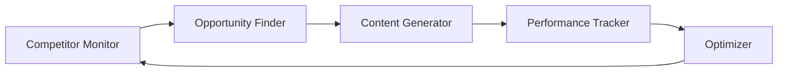

# Etsy SEO Automation: Scale Your Print-on-Demand Business with AI

Running a successful **print-on-demand (POD) business on Etsy** requires relentless attention to SEO optimization. From keyword research to listing creation, the manual workload can be overwhelming. **AI-powered Etsy SEO automation** is revolutionizing how POD sellers scale their businesses—and **Hermes AI agent** technology is at the forefront of this transformation.

## The Challenge of Manual Etsy SEO

Etsy receives over 90 million active buyers searching for unique products. Standing out requires:

- **Keyword-optimized titles** (140 characters max)
- **Compelling product descriptions** (SEO-friendly yet natural)
- **Strategic tag selection** (13 tags per listing)
- **Category optimization** for search visibility
- **Continuous competitor monitoring**
- **Regular listing updates** to maintain rankings

**Manual efforts burn out sellers**: The average successful POD seller spends 15-20 hours per week on SEO tasks alone.

## How AI Transforms Etsy SEO

### The Traditional Approach vs. AI Automation

| Task | Manual Time | AI Automation Time | Time Savings |
|------|-------------|-------------------|--------------|
| Keyword Research | 2-3 hours | 15 minutes | 85% |
| Title Optimization | 30 min/listing | 2 min/listing | 93% |
| Description Writing | 45 min/listing | 5 min/listing | 89% |
| Tag Selection | 20 min/listing | Instant | 100% |
| Competitor Analysis | 3-4 hours/week | 10 min/week | 96% |
| **Total Weekly** | **20+ hours** | **2-3 hours** | **90%** |

## The Hermes AI Agent Approach to Etsy SEO

**Hermes AI agents** create an end-to-end **automated SEO workflow** for your Etsy business:

### Agent 1: Market Research Agent

```python
class EtsyMarketResearchAgent:
    """Discovers trending products and high-value keywords"""
    
    async def analyze_trends(self, category: str):
        search_data = await self.fetch_etsy_trends(category)
        keyword_volumes = await self.get_search_volumes(
            search_data.trending_terms
        )
        
        return {
            "high_opportunity_keywords": self.identify_gaps(
                keyword_volumes
            ),
            "competition_level": self.assess_competition(
                category
            ),
            "trending_products": search_data.products
        }
```

**Capabilities**:
- Monitor trending searches on Etsy
- Analyze competitor product performance
- Identify low-competition, high-demand niches
- Track seasonal trends

### Agent 2: Keyword Generator Agent

```python
class EtsyKeywordAgent:
    """Generates Etsy-optimized keywords and tags"""
    
    async def optimize_for_etsy(self, product: Product):
        # Etsy-specific factors:
        # - Title: 140 characters max
        # - Tags: 13 per listing, max 20 characters each
        # - Attributes: Color, style, occasion
        
        seo_data = {
            "primary_keyword": self.select_primary(
                product, EtsyConstraints()
            ),
            "secondary_keywords": self.find_related(
                product.category, count=25
            ),
            "tags": self.generate_tags(
                product, max_tags=13, max_length=20
            ),
            "attributes": self.map_attributes(product)
        }
        return seo_data
```

**Output includes**:
- Primary keyword for title positioning
- Long-tail keywords for the description
- Exact-match tags for Etsy's algorithm
- Suggested attributes to maximize visibility

### Agent 3: Content Generation Agent

```python
class EtsyContentAgent:
    """Creates SEO-optimized listing content"""
    
    async def create_listing(self, product: Product, 
                            keywords: SEOData):
        title = self.craft_title(
            product, keywords.primary_keyword, 
            max_chars=140
        )
        
        description = self.write_description(
            product, keywords.secondary_keywords,
            style="friendly_expert",
            sections=["features", "materials", "care", "shipping"]
        )
        
        return Listing(title=title, description=description)
```

## Automated SEO Strategy Implementation

### Phase 1: Foundation Setup

**Week 1-2: Initial Optimization**

1. **Complete Store Audit**
   - Agent analyzes all existing listings
   - Identifies SEO issues (missing tags, weak titles)
   - Prioritizes listings by traffic potential

2. **Keyword Architecture**
   - Build keyword database for your niche
   - Create keyword clusters for product categories
   - Map keywords to specific listings

### Phase 2: Continuous Optimization

**Week 3+: Automation at Work**



**Automated Actions**:
- **Daily**: Track competitor pricing and keywords
- **Weekly**: Update underperforming listings
- **Bi-weekly**: Generate new tags based on trending searches
- **Monthly**: Comprehensive ranking report

## Print-on-Demand Specific Strategies

### Design-to-Listing Pipeline

The **AI print on demand** workflow automates the entire process:

```
Design Created
      │
      ▼
┌─────────────────┐
│ Image Analysis  │ ← Extract colors, themes, styles
│ Agent           │
└────────┬────────┘
         │
         ▼
┌─────────────────┐
│ Keyword Gen     │ ← Identify search terms
│ Agent           │
└────────┬────────┘
         │
         ▼
┌─────────────────┐
│ Content Creator │ ← Write SEO-optimized copy
│ Agent           │
└────────┬────────┘
         │
         ▼
┌─────────────────┐
│ Listing Builder │ ← Format for Etsy
│ Agent           │
└────────┬────────┘
         │
         ▼
    Live on Etsy
```

### Niche-Specific Keyword Strategies

**T-Shirt Optimization**:
```
Title: Custom Dog Mom T-Shirt, Personalized Pet Name Shirt,
      Gift for Dog Lovers, Unisex Graphic Tee

Tags: 
- dog mom shirt
- dog lover gift
- personalized pet
- custom dog tshirt
- dog mama gift

Attributes:
- Style: Graphic Tee
- Occasion: Mother's Day, Birthday
- Material: Cotton
```

**Mug Optimization**:
```
Title: Funny Coffee Mug, Sarcastic Morning Gift, Novelty 
      Office Cup, Ceramic Tea Mug, Coworker Present

Tags:
- funny coffee mug
- sarcastic gift
- office humor
- novelty mug
- ceramic coffee cup
- coworker gift
```

## Advanced Automation Techniques

### A/B Testing Automation

```python
class EtsyABTestAgent:
    """Automatically tests different SEO strategies"""
    
    async def run_test(self, listing_id: str, variants: List):
        # Create variant listings
        variants_created = await self.create_variants(
            listing_id, variants
        )
        
        # Monitor for statistical significance
        results = await self.monitor_performance(
            variants_created, duration_days=14
        )
        
        # Deploy winning variant
        winner = self.select_winner(results)
        await self.deploy_variant(listing_id, winner)
```

**What Gets Tested**:
- Title structures
- Opening sentence variations
- Tag combinations
- Pricing strategies
- Image arrangements

### Dynamic Reoptimization

When performance drops, agents automatically react:

```python
async def monitor_and_reoptimize():
    listings = await fetch_listings()
    
    for listing in listings:
        metrics = await get_performance(listing.id)
        
        if metrics.views < threshold:
            # SEO decay detected
            new_keywords = await generate_fresher_keywords(
                listing.category
            )
            await update_listing(listing.id, new_keywords)
            await notify_seller(listing.id, "updated")
```

### Competitor Intelligence

```python
class CompetitorMonitorAgent:
    async def track_competitors(self, competitors: List[str]):
        for competitor in competitors:
            products = await scrape_listings(competitor)
            
            analysis = {
                "top_keywords": self.extract_keywords(products),
                "pricing_strategy": self.analyze_pricing(products),
                "best_sellers": self.identify_bestsellers(products),
                "content_trends": self.analyze_descriptions(products)
            }
            
            await update_strategy_recommendations(analysis)
```

## POD Automation Case Studies

### Case Study 1: The T-Shirt Empire

**Seller**: Custom apparel shop with 1,200+ designs
**Challenge**: Could only optimize 50 listings/week manually
**Solution**: Hermes **POD automation** system

**Results After 90 Days**:
- Listings fully optimized: 1,200 (100%)
- Organic traffic increase: +340%
- Conversion rate improvement: +28%
- Time saved weekly: 18 hours
- Revenue growth: +$12,400/month

### Case Study 2: The Mug Maven

**Seller**: Niche mug business (coffee humor)
**Challenge**: Struggling with keyword saturation
**Solution**: AI-driven niche discovery + SEO optimization

**Results After 60 Days**:
- Discovered 15 new profitable niches
- New keywords driving 2,400 monthly views
- First page rankings: 47 keywords
- Sales increase: +185%

### Case Study 3: The Multi-Store Operator

**Seller**: 5 Etsy stores, various POD products
**Challenge**: Scaling across multiple brands
**Solution**: **Multi-agent orchestration** managing all stores

**Results After 120 Days**:
- 5 stores managed simultaneously
- Consistent brand voice maintained
- 8,500+ listings optimized
- Revenue per store increased 75% on average

## Measuring SEO Success

### Key Performance Indicators

| Metric | Baseline | Target | Measurement |
|--------|----------|--------|-------------|
| **Organic Views** | Current | +200% in 90 days | Etsy Stats |
| **Click-Through Rate** | Current | > 3% | Etsy Search |
| **Conversion Rate** | Current | > 2% | Etsy Analytics |
| **Average Position** | Current | Top 10 | SEO tools |
| **Reviews** | Current | 4.8+ stars | Etsy Dashboard |

### Automated Reporting Dashboard

The **Hermes AI agent** provides:

- **Weekly**: Ranking changes for top 50 keywords
- **Bi-weekly**: Competitor movement analysis
- **Monthly**: Comprehensive SEO health score
- **Quarterly**: ROI and revenue impact report

## Getting Started: Your 30-Day Action Plan

### Week 1: Assessment & Setup

- [ ] Connect your Etsy shop to Hermes dashboard
- [ ] Run comprehensive SEO audit
- [ ] Prioritize listings for optimization
- [ ] Set up competitor monitoring

### Week 2: Foundation Optimization

- [ ] Optimize top 100 listings
- [ ] Fix critical SEO issues
- [ ] Implement new keyword strategy
- [ ] Set up automated tracking

### Week 3: Scaling Content

- [ ] Batch process 500+ listings
- [ ] Create keyword templates for categories
- [ ] Set up A/B testing framework
- [ ] Enable auto-reoptimization

### Week 4: Analysis & Refinement

- [ ] Review 28-day performance metrics
- [ ] Adjust strategies based on data
- [ ] Scale successful tactics
- [ ] Plan next optimization cycle

## Common SEO Mistakes to Avoid

### ❌ Keyword Stuffing
**Before**: "Custom Mug, Custom Coffee Mug, Personalized Mug, Coffee Mug Custom, Customized Mug"
**After**: "Personalized Coffee Mug - Custom Name Cup, Novelty Gift for Coffee Lovers"

### ❌ Ignoring Tags
**Mistake**: Using only 5-7 of 13 available tags
**Fix**: Use all 13 strategic tags

### ❌ Weak Opening Lines
**Before**: "This is a great mug..."
**After**: "Start your day with a smile using this personalized coffee mug..."

### ❌ Copy-Paste Descriptions
**Mistake**: Same description for every product
**Fix**: Unique, optimized descriptions per listing

## The Future of Etsy SEO

### Emerging Trends

1. **Visual Search**: AI interprets product images
2. **Voice Search Optimization**: Conversational keywords
3. **Local SEO**: Geographic targeting
4. **Video Content**: Product demonstration optimization

### Hermes Platform Roadmap

- **Q1 2025**: Visual SEO optimization
- **Q2 2025**: International marketplace support
- **Q3 2025**: Video listing automation
- **Q4 2025**: AI-generated product photography

## Conclusion

**Etsy SEO automation** through **Hermes AI agents** transforms the POD business from a time-intensive grind into a scalable, data-driven operation. With **90% time savings** on SEO tasks and the ability to optimize thousands of listings, sellers can focus on what matters: creating great designs and growing their business.

**Ready to automate your Etsy SEO?**

1. [Start Free Trial](/signup) - 14 days, no credit card
2. [Book a Demo](/demo) - See automation in action
3. [Join 2,000+ Sellers](https://discord.gg/hermesmission) - Community support

---

*Scale your Etsy business with the power of AI. Hermes Mission Freedom makes it possible.*