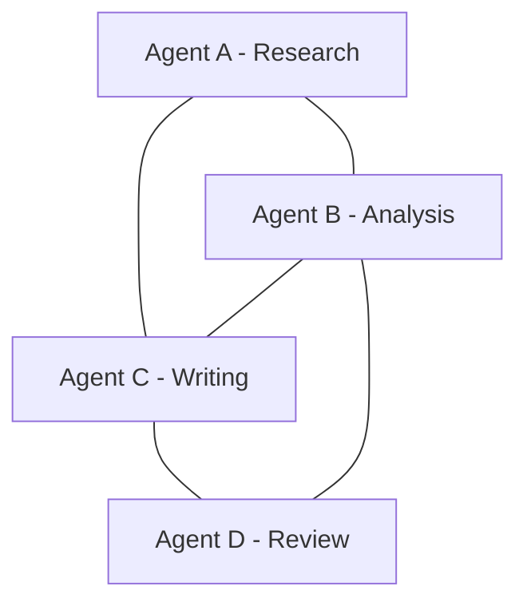
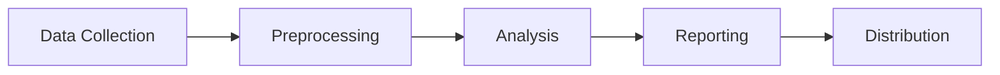
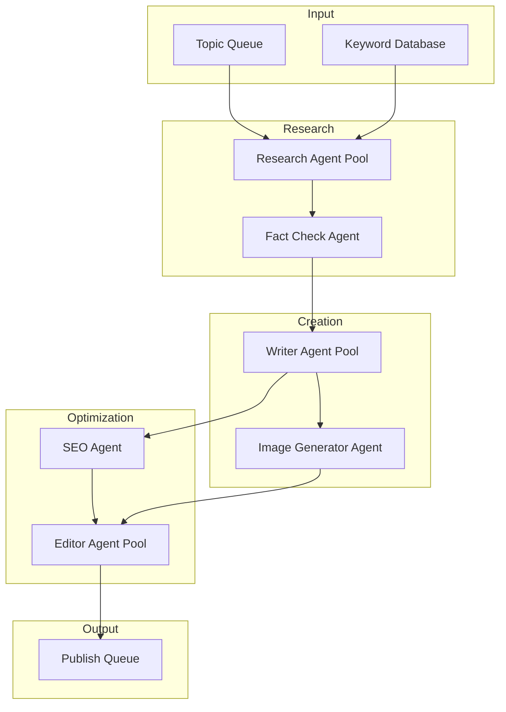

# Multi-Agent Orchestration: Architecting Scalable AI Systems

**Multi-agent orchestration** has become the cornerstone of sophisticated AI implementations in 2024. As businesses move beyond single-agent solutions, understanding how to coordinate multiple **Hermes AI agents** effectively is crucial for building powerful, scalable systems.

## Understanding Multi-Agent Systems

A **multi-agent system** consists of multiple autonomous agents that interact with each other and their environment to achieve individual or collective goals. Unlike monolithic AI systems, these distributed architectures offer flexibility, resilience, and specialization.

### Key Benefits of Multi-Agent Orchestration

| Benefit | Description | Impact |
|---------|-------------|--------|
| **Specialization** | Agents focus on specific tasks | Higher quality outputs |
| **Parallelism** | Multiple agents work simultaneously | Faster processing |
| **Fault Tolerance** | Failure of one agent doesn't crash the system | Increased reliability |
| **Scalability** | Add agents as workload increases | Handle growing demands |
| **Modularity** | Swap or update individual agents | Easier maintenance |

## Core Architectural Patterns

### 1. Hierarchical Orchestration

```
                    ┌─────────────────┐
                    │ Master Agent    │
                    │ (Orchestrator)  │
                    └────────┬────────┘
                             │
            ┌────────────────┼────────────────┐
            │                │                │
     ┌──────▼──────┐  ┌─────▼─────┐  ┌──────▼──────┐
     │ Team Lead 1 │  │Team Lead 2│  │ Team Lead 3 │
     └──────┬──────┘  └─────┬─────┘  └──────┬──────┘
            │               │               │
      ┌─────┴─────┐  ┌─────┴─────┐  ┌─────┴────┐
      │ Worker    │  │ Worker    │  │ Worker   │
      │ Agents    │  │ Agents    │  │ Agents   │
      └───────────┘  └───────────┘  └──────────┘
```

**Use Case**: Enterprise workflows with clear departmental structures

**Best Practices**:
- Implement heartbeat monitoring at each level
- Define clear escalation paths
- Use circuit breakers to prevent cascading failures

### 2. Peer-to-Peer Network

In this pattern, all agents communicate as equals:



**Use Case**: Collaborative problem-solving and brainstorming

**Advantages**:
- No single point of failure
- Natural load distribution
- Decentralized decision making

### 3. Workflow Pipeline

Agents are arranged in a sequence where each processes output from the previous:



**Use Case**: ETL pipelines, content creation workflows, approval chains

### 4. Competitive Selection

Multiple agents produce outputs, and the best is selected:

```python
agents = [agent_a, agent_b, agent_c, agent_d]
results = await asyncio.gather(*[agent.generate(request) for agent in agents])
best_result = select_best_output(results)
```

## Communication Protocols

Effective **multi-agent orchestration** requires robust communication mechanisms:

### Message Passing

```python
class AgentMessage:
    def __init__(self, sender: str, recipient: str, 
                 content: Any, priority: int = 1):
        self.sender = sender
        self.recipient = recipient
        self.content = content
        self.priority = priority
        self.timestamp = time.time()
        self.message_id = str(uuid.uuid4())
```

### Shared Memory

For stateful coordination:

```python
class SharedContext:
    def __init__(self):
        self.memory = {}
        self.lock = asyncio.Lock()
    
    async def update(self, key: str, value: Any):
        async with self.lock:
            self.memory[key] = value
    
    async def get(self, key: str) -> Any:
        async with self.lock:
            return self.memory.get(key)
```

### Event-Driven Architecture

```python
# Subscribe to events
await event_bus.subscribe(
    topic="agent.completed",
    handler=process_completion
)

# Publish events
await event_bus.publish(
    topic="agent.completed",
    data={"agent_id": agent_id, "result": result}
)
```

## State Management Strategies

### Centralized State

```
┌─────────────────────────────────────────┐
│           State Store                   │
│  ┌──────────┐ ┌──────────┐ ┌─────────┐ │
│  │ Agent    │ │ Workflow │ │ Shared  │ │
│  │ States   │ │ Progress │ │ Memory  │ │
│  └──────────┘ └──────────┘ └─────────┘ │
└─────────────────────────────────────────┘
                   ▲
        ┌─────────┼─────────┐
        │         │         │
   ┌────┴───┐ ┌───┴────┐ ┌──┴────┐
   │Agent 1 │ │Agent 2 │ │Agent 3│
   └────────┘ └────────┘ └───────┘
```

**Pros**: Consistent state, easy debugging
**Cons**: Potential bottleneck, single point of failure

### Distributed State

Each agent maintains its own state with periodic synchronization:

```python
class DistributedStateManager:
    def __init__(self, agent_id: str):
        self.agent_id = agent_id
        self.local_state = {}
        self.version_vector = {}
    
    async def sync_with_others(self, other_agents: List[str]):
        for agent in other_agents:
            remote_state = await self.request_state(agent)
            self.merge_state(remote_state)
```

## Coordination Mechanisms

### Auction-Based Coordination

```python
async def auction_task(task: Task, agents: List[Agent]):
    # Request bids from all capable agents
    bids = await asyncio.gather(*[
        agent.bid(task) for agent in agents
    ])
    
    # Select best bid
    winner = min(bids, key=lambda b: b.estimated_time)
    await winner.assign(task)
    
    return winner
```

### Consensus Protocol

For critical decisions requiring agreement:

```python
async def reach_consensus(proposal: str, agents: List[Agent]):
    votes = await asyncio.gather(*[
        agent.vote(proposal) for agent in agents
    ])
    
    if sum(votes) / len(votes) > CONSENSUS_THRESHOLD:
        return "accepted"
    return "rejected"
```

### Leader Election

When a coordinator is needed:

```python
async def elect_leader(agents: List[Agent]):
    # Sort by capability score and load
    candidates = sorted(agents, 
        key=lambda a: (a.capability_score, -a.current_load),
        reverse=True
    )
    return candidates[0]
```

## Scaling Strategies

### Horizontal Scaling

```
                 Load Balancer
                       │
       ┌───────────────┼───────────────┐
       │               │               │
   ┌───┴───┐     ┌────┴────┐    ┌────┴────┐
   │Agent  │     │ Agent   │    │ Agent   │
   │Pod 1  │     │ Pod 2   │    │ Pod 3   │
   └───────┘     └─────────┘    └─────────┘
```

Implement with Kubernetes or Docker Swarm for auto-scaling.

### Dynamic Agent Spawning

```python
class AutoScaler:
    def __init__(self, min_agents: int = 2, max_agents: int = 20):
        self.min_agents = min_agents
        self.max_agents = max_agents
        self.agents = []
    
    async def scale_based_on_load(self, current_queue_length: int):
        target = min(
            self.max_agents,
            max(self.min_agents, current_queue_length // 5)
        )
        
        if target > len(self.agents):
            await self.spawn_agents(target - len(self.agents))
        elif target < len(self.agents):
            await self.remove_agents(len(self.agents) - target)
```

### Sharding

Distribute workload by domain:

```python
def get_agent_for_task(task: Task) -> Agent:
    shard = hash(task.domain) % len(agent_pools)
    return agent_pools[shard].get_available_agent()
```

## Fault Tolerance Strategies

### Circuit Breaker Pattern

```python
class CircuitBreaker:
    def __init__(self, failure_threshold: int = 5, 
                 timeout: int = 60):
        self.failure_count = 0
        self.failure_threshold = failure_threshold
        self.timeout = timeout
        self.state = "CLOSED"  # CLOSED, OPEN, HALF_OPEN
        self.last_failure_time = None
    
    async def call(self, func, *args, **kwargs):
        if self.state == "OPEN":
            if time.time() - self.last_failure_time > self.timeout:
                self.state = "HALF_OPEN"
            else:
                raise CircuitOpenError("Circuit is open")
        
        try:
            result = await func(*args, **kwargs)
            self.on_success()
            return result
        except Exception as e:
            self.on_failure()
            raise e
```

### Retry with Exponential Backoff

```python
@retry(
    stop=stop_after_attempt(3),
    wait=wait_exponential(multiplier=1, min=4, max=10),
    retry=retry_if_exception_type(TransientError)
)
async def agent_request(agent: Agent, request):
    return await agent.process(request)
```

### Graceful Degradation

When agents fail, reduce functionality rather than crash:

```python
async def process_with_fallback(primary: Agent, 
                                fallback: Agent, 
                                request):
    try:
        return await primary.process(request)
    except AgentUnavailableError:
        logger.warning(f"Primary agent failed, using fallback")
        return await fallback.process(request)
```

## Real-World Implementation

### Case Study: Automated Content Pipeline

**Problem**: Generate 1000 SEO-optimized articles daily

**Multi-Agent Solution**:



**Results**:
- 10x throughput improvement
- 90% reduction in manual review time
- 40% better SEO rankings

## Performance Monitoring

### Key Metrics

| Metric | Description | Target |
|--------|-------------|--------|
| **Latency** | End-to-end processing time | < 5s per task |
| **Throughput** | Tasks completed per minute | > 100/min |
| **Success Rate** | Percentage of successful completions | > 99% |
| **Agent Utilization** | Percentage of busy agents | 60-80% |
| **Memory Usage** | Average memory per agent | < 2GB |

### Observability Stack

```python
# Telemetry
telemetry.record_metric(
    name="agent.task_duration",
    value=duration,
    tags={"agent_id": agent_id, "task_type": task_type}
)

# Distributed tracing
with tracer.span("multi-agent-workflow") as span:
    span.set_attribute("workflow_id", workflow_id)
    await orchestrator.execute(workflow)
```

## Security Considerations

### Authentication & Authorization

```python
class SecureAgent:
    def __init__(self, agent: Agent, credentials: Credentials):
        self.agent = agent
        self.credentials = credentials
    
    async def process(self, request: Request):
        if not self.verify_token(request.token):
            raise AuthenticationError()
        
        if not self.check_permissions(request.operation):
            raise AuthorizationError()
        
        return await self.agent.process(request)
```

### Isolation

- Network segmentation between agent groups
- Resource quotas per agent
- Sandboxed execution environments

## Best Practices Summary

1. **Start Simple**: Begin with 2-3 agents, expand gradually
2. **Define Clear Contracts**: Standardize interfaces between agents
3. **Monitor Everything**: Log all inter-agent communication
4. **Plan for Failure**: Assume agents will fail and design accordingly
5. **Optimize Bottlenecks**: Profile and improve slow agents first
6. **Version Carefully**: Maintain backward compatibility during updates

## Getting Started with Hermes

**Hermes Mission Freedom** provides enterprise-grade **multi-agent orchestration** capabilities:

1. **Visual Workflow Designer**: Drag-and-drop agent coordination
2. **Auto-Scaling**: Automatically add agents based on demand
3. **Observability Dashboard**: Real-time monitoring and alerting
4. **Security Tools**: Built-in authentication and authorization

### Next Steps

1. [Schedule a Demo](/demo) - See multi-agent orchestration in action
2. [Read the Docs](/docs) - Deep dive into implementation details
3. [Join the Community](https://discord.gg/hermesmission) - Connect with other builders

---

*Build production-ready multi-agent systems with Hermes Mission Freedom.*