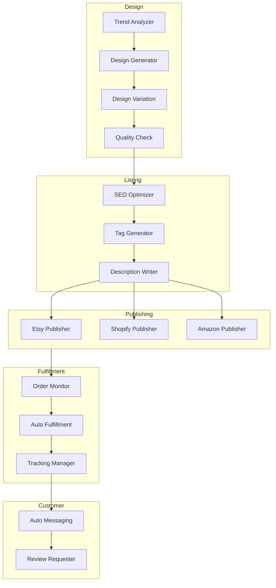
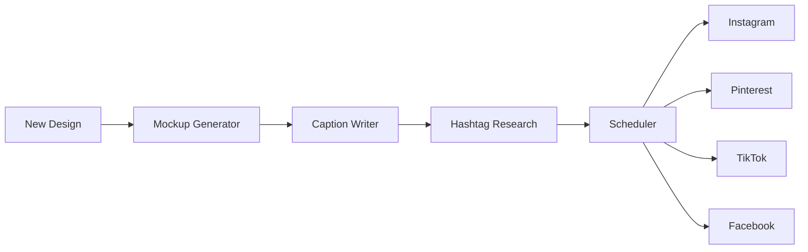

# Print-on-Demand Automation: AI-Powered Scaling for 2025

The **print-on-demand (POD)** industry is experiencing explosive growth, with the market projected to reach $10 billion by 2025. But success in this competitive space requires more than great designs—it demands sophisticated **automation**.

Enter **Hermes AI agent** technology: the complete solution for **print on demand automation** that transforms manual operations into scalable, profitable businesses.

## The State of POD in 2024-2025

### Market Opportunities

| Segment | Growth Rate | Opportunity Level |
|---------|-------------|-------------------|
| Custom Apparel | +15% YoY | High |
| Home Decor | +22% YoY | Very High |
| Accessories | +18% YoY | High |
| Digital Downloads | +30% YoY | Emerging |

### The Automation Imperative

**Manual POD Operations** (10 hours/day):
- Design creation: 3 hours
- Listing optimization: 2 hours
- Order management: 1 hour
- Customer service: 2 hours
- Marketing: 2 hours

**Automated POD Operations** (2 hours/day):
- Quality control: 1 hour
- Strategy review: 30 minutes
- Creative direction: 30 minutes

**Net Gain**: 8 hours/day for growth activities

## The Hermes POD Automation Stack

### Complete Automation Workflow



### Core Automation Agents

**1. Trend Intelligence Agent**

```python
class PODTrendAgent:
    """Discovers viral-worthy design opportunities"""
    
    async def analyze_trends(self, platforms: List[str]):
        data_sources = {
            "etsy": self.scrape_etsy_trends(),
            "pinterest": self.analyze_pinterest_pins(),
            "tiktok": self.track_tiktok_hashtags(),
            "instagram": self.monitor_instagram_trends()
        }
        
        trends = await asyncio.gather(*data_sources.values())
        
        return self.identify_opportunities(trends)
    
    def identify_opportunities(self, trends):
        # Calculate opportunity scores
        return [
            {
                "niche": trend.niche,
                "growth_rate": trend.growth,
                "competition_level": trend.competition,
                "time_to_peak": trend.projected_peak,
                "design_recommendations": self.generate_ideas(trend)
            }
            for trend in trends if trend.opportunity_score > 0.7
        ]
```

**2. Design Generation Agent**

```python
class PODDesignAgent:
    """Creates print-ready designs at scale"""
    
    async def generate_design(self, concept: str, 
                             styles: List[str]):
        # Generate multiple style variations
        designs = []
        for style in styles:
            design = await self.create_design(
                concept=concept,
                style=style,
                format="vector",
                sizes=["small", "medium", "large"]
            )
            designs.append(design)
        
        # Create mockups for each platform
        mockups = await self.create_mockups(
            designs, 
            products=["tshirt", "mug", "poster", "tote"]
        )
        
        return {"designs": designs, "mockups": mockups}
```

**3. Listing Optimization Agent**

```python
class PODListingAgent:
    """Creates platform-optimized listings"""
    
    async def create_optimized_listing(self, design: Design):
        # Platform-specific optimization
        listings = {
            "etsy": await self.optimize_for_etsy(design),
            "shopify": await self.optimize_for_shopify(design),
            "amazon": await self.optimize_for_amazon(design)
        }
        
        # Generate SEO content
        for platform, listing in listings.items():
            listing.keywords = await self.generate_keywords(
                design, platform
            )
            listing.title = await self.optimize_title(
                design, listing.keywords
            )
            listing.description = await self.write_description(
                design, listing.keywords
            )
        
        return listings
```

## Platform-Specific Automation

### Etsy Automation

**Automated Listing Creation**:

```python
async def create_etsy_listing(design: Design):
    listing = {
        "title": await generate_etsy_title(design),  # Max 140 chars
        "description": await generate_etsy_description(design),
        "tags": await generate_etsy_tags(design),  # 13 tags
        "attributes": await map_etsy_attributes(design),
        "pricing": await calculate_etsy_price(design),
        "images": await generate_etsy_images(design),  # 10 images
        "variations": await create_etsy_variations(design)
    }
    
    return await post_to_etsy(listing)
```

**Automated Renewal Strategy**:
- Re-list high-performing designs before expiration
- Remove underperformers from auto-renewal
- Split-test new images on renewal

### Shopify Automation

**Store Management Agent**:

```python
class ShopifyAutomationAgent:
    async def manage_store(self, store: Store):
        # Auto-import designs
        new_designs = await self.get_new_designs()
        for design in new_designs:
            await self.create_product(design, store)
        
        # Dynamic pricing
        await self.adjust_prices_based_on_competition(store)
        
        # Inventory sync
        await self.sync_with_print_providers(store)
```

### Print Provider Integration

**Automated Fulfillment**:

```python
async def process_order(order: Order):
    # Select optimal print provider
    provider = await select_print_provider(
        product=order.product,
        destination=order.shipping_address,
        quality_requirement=order.quality_tier
    )
    
    # Submit order
    fulfillment = await provider.submit_order(order)
    
    # Track status
    await track_fulfillment(fulfillment.tracking_id)
    
    # Update customer
    await notify_customer(order.customer, fulfillment)
```

## Advanced Design Automation

### AI-Powered Design Creation

**Multi-Style Generation**:

Input concept: "Dog mom aesthetic with minimalist design"

Output variations:
1. **Typography-focused**: "Dog Mom est. 2024"
2. **Illustration style**: Cute dog silhouette with heart
3. **Vintage aesthetic**: Retro letterpress look
4. **Modern minimalist**: Clean sans-serif with geometric elements

### Automated Design Refinement

**Quality Assurance Pipeline**:

```python
async def quality_check_design(design: Design):
    checks = {
        "resolution": verify_minimum_dpi(design, 300),
        "color_space": ensure_print_ready_colors(design),
        "bleed_area": check_bleed_and_safe_zones(design),
        "file_format": validate_vector_or_high_res_png(design),
        "copyright": scan_for_trademark_issues(design)
    }
    
    results = await asyncio.gather(*checks.values())
    
    if all(results):
        return {"status": "approved", "design": design}
    else:
        return await auto_fix_design(design, results)
```

## Market Analysis Automation

### Competitor Intelligence Agent

```python
class PODCompetitorAgent:
    async def analyze_competitors(self, niche: str):
        # Gather competitor data
        competitors = await self.find_top_sellers(niche)
        
        analysis = []
        for competitor in competitors:
            data = {
                "top_designs": await self.extract_best_sellers(
                    competitor.store
                ),
                "pricing_strategy": await self.analyze_pricing(
                    competitor.products
                ),
                "listing_optimization": await self.assess_seo(
                    competitor.listings
                ),
                "review_patterns": await self.analyze_reviews(
                    competitor.reviews
                ),
                "design_gaps": await self.identify_opportunities(
                    competitor.catalog
                )
            }
            analysis.append(data)
        
        return self.synthesize_strategy(analysis)
```

### Pricing Intelligence

**Dynamic Pricing Engine**:

```python
async def optimize_pricing(product: Product):
    # Get market data
    market_data = await analyze_competitor_prices(
        product.category
    )
    
    # Calculate optimal price
    optimal_price = calculate_profit_maximizing_price(
        base_cost=product.production_cost,
        competitor_prices=market_data.prices,
        demand_curve=market_data.demand,
        elasticity=market_data.price_elasticity
    )
    
    # Update across platforms
    await update_pricing(product, optimal_price)
```

## Marketing Automation for POD

### Social Media Automation

**The Content Factory**:



**Pinterest-Specific Strategy**:
- Generate 10 pins per design
- Optimize pin descriptions with keywords
- Schedule for optimal posting times
- Auto-create idea pins for trending designs

**Instagram Integration**:
- Auto-post to feed with optimized captions
- Story highlights for new arrivals
- Reel creation for viral-worthy designs
- Hashtag sets tailored to each design niche

### Email Marketing Automation

**Customer Lifecycle Flows**:

| Trigger | Email | Timing | Agent |
|---------|-------|--------|-------|
| First Purchase | Thank You + Discount | Immediate | OnboardingAgent |
| Order Shipped | Tracking + Upsell | On fulfillment | TransactionalAgent |
| 30 Days Post | Review Request | Day 30 | ReviewAgent |
| Reorder Due | Replenishment | Predicted | RetentionAgent |
| Design Release | New Arrival Alert | Launch | LaunchAgent |

## Performance Analytics & Optimization

### Automated Reporting Dashboard

**Daily Metrics**:
- New orders and revenue
- Top-performing designs
- Traffic sources and conversions
- Print provider performance

**Weekly Analysis**:
- Design performance trends
- Platform comparison (Etsy vs Shopify vs Amazon)
- Customer satisfaction scores
- Inventory status and alerts

**Monthly Deep Dive**:
- Profitability by product line
- Seasonal trend analysis
- Competitor movement tracking
- Strategy recommendations

### Predictive Analytics

```python
class PODPredictionAgent:
    async def forecast_performance(self, timeframe: str):
        # Historical analysis
        historical = await get_historical_data(timeframe)
        
        # Trend projection
        trends = await analyze_market_trends()
        
        # Prediction model
        forecast = self.ml_model.predict(
            historical_sales=historical,
            market_trends=trends,
            seasonality=self.get_seasonal_factors(),
            marketing_calendar=self.get_campaigns()
        )
        
        return {
            "projected_revenue": forecast.revenue,
            "inventory_needs": forecast.inventory,
            "design_focus": forecast.recommended_designs,
            "budget_allocation": forecast.marketing_budget
        }
```

## Real-World Success Stories

### Story 1: The Solo Designer

**Before Hermes**:
- 20 designs/month
- $2,000/month revenue
- 60 hours/week workload

**After Automation (6 months)**:
- 400 designs/month
- $18,500/month revenue
- 20 hours/week workload

**Key Wins**:
- Auto-generated 2,400 designs
- 15x revenue increase
- 5 automated sales channels

### Story 2: The Multi-Store Operator

**Challenge**: Managing 8 POD stores across platforms
**Solution**: Hermes **multi-agent orchestration**

**Results (12 months)**:
- Combined revenue: $45,000/month
- Management time: 15 hours/week (was 80+)
- Stores: 8 active, fully automated
- Team: 1 person + AI agents

### Story 3: The Niche Dominator

**Niche**: Pet memorial products
**Strategy**: AI-driven trend anticipation

**Results (3 months)**:
- Market capture: 12% of niche
- Average order value: $38.50
- Review rating: 4.9 stars
- Repeat purchase rate: 34%

## Compliance and Best Practices

### automated Compliance Checks

```python
async def compliance_scan(design: Design):
    scans = {
        "trademark": await check_trademark_database(design),
        "copyright": await scan_copyright_infringement(design),
        "licensing": verify_licensed_elements(design),
        "platform_rules": validate_platform_requirements(design)
    }
    
    if not all(scans.values()):
        await flag_for_review(design)
    else:
        await approve_for_publishing(design)
```

### Print Quality Monitoring

- Automated sample ordering
- Quality score tracking
- Provider performance rankings
- Customer feedback integration

## Getting Started: Implementation Roadmap

### Phase 1: Foundation (Week 1-2)

- [ ] Connect print providers (Printful, Gooten, SPOD)
- [ ] Integrate sales platforms (Etsy, Shopify)
- [ ] Import existing designs
- [ ] Set up automation workflows

### Phase 2: Automation (Week 3-4)

- [ ] Deploy design generation agents
- [ ] Configure listing automation
- [ ] Set up social distribution
- [ ] Launch email sequences

### Phase 3: Optimization (Week 5-8)

- [ ] Analyze performance data
- [ ] Fine-tune agent behavior
- [ ] Expand to new platforms
- [ ] Scale winning designs

### Phase 4: Scaling (Week 9-12)

- [ ] Enter new niches automatically
- [ ] Optimize pricing strategies
- [ ] Launch seasonal campaigns
- [ ] Build authority brands

## Future of POD Automation

### Emerging Technologies

1. **AI-Generated Mockup Models**: Virtual models showcasing designs
2. **Dynamic Product Creation**: AI designs products based on trends
3. **Voice Commerce**: AI handles voice-activated orders
4. **AR Try-On Integration**: Automated AR experience creation

### 2025 Roadmap (Hermes Platform)

- **Q1**: AI video ad generation
- **Q2**: Automated influencer outreach
- **Q3**: International market expansion
- **Q4**: AI-powered brand building

## Pricing and Plans

| Plan | Designs/Month | Platforms | Best For |
|------|---------------|-----------|----------|
| **Starter** | 100 | 2 | New sellers |
| **Growth** | 500 | 5 | Growing stores |
| **Scale** | Unlimited | Unlimited | Empire builders |

## Conclusion

**Print on demand automation** through **Hermes AI agents** eliminates the manual bottlenecks that prevent POD businesses from scaling. With automated design generation, listing optimization, fulfillment management, and marketing, you can focus on strategy while AI handles execution.

The POD landscape is more competitive than ever—but with the right automation tools, small teams can compete at enterprise scale.

**Ready to automate your POD business?**

1. [Start Free Trial](/signup) - 30 days, no credit card
2. [Book Demo](/demo) - See automation live
3. [View Case Studies](/case-studies) - Real results from real sellers

---

*Scale your print-on-demand business from hobby to empire with Hermes Mission Freedom.*